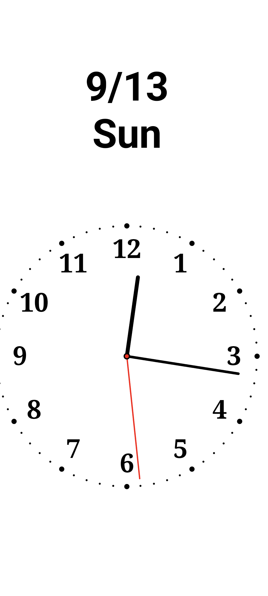
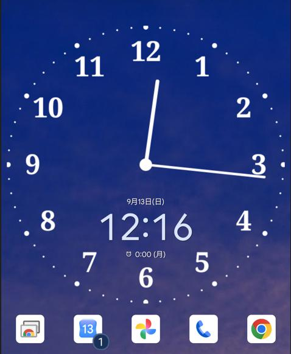

# BW_clock_phone

<p align="center">
  
  
  
</p>
<p align="center">Left to right: app (dark theme), app (light theme), home-screen widget<br>左から: 本体（黒背景）、本体（白背景）、ホーム画面ウィジェット</p>

[English](#english) | [日本語](#日本語)

---

## English

A black-and-white analog clock for Android phones. It fills a portrait screen, keeps the display on, and is meant for turning a spare phone into a desk or bedside clock. The same clock is also available as a home-screen widget.

This is the phone port of [BW_clock](https://github.com/lunelukkio/BW_clock), the Android TV version for laser projectors.

### Features

- Fullscreen portrait analog clock with a black or white background and a red second hand
- Screen stays on while the app is in the foreground
- Burn-in prevention: the clock face drifts slowly along a small orbit (one lap every 6 hours)
- In-app brightness (0–100%) implemented as a dark overlay, so the system backlight is untouched
- Rotation in 90° steps without leaving portrait mode
- Adjustable size, position, font, frame, tick-mark dots, numbers, hand thickness and hand tip shape
- Optional date display (month/day and weekday) with its own position, size and offset
- Home-screen widget with an independent set of settings
- Japanese / English UI, switchable at runtime

### Requirements

- Android 5.0 (API 21) or later. Built against API 36.
- A launcher that supports app widgets, if you want the widget.
- No network access. The app declares no INTERNET permission. `WAKE_LOCK`, `ACCESS_NETWORK_STATE` and `FOREGROUND_SERVICE` appear in the final APK because the Glance / WorkManager library merges them in; the app's own code does not use them.

### Install

The app is not on Google Play. Install the APK directly:

1. Download `app/release/app-release.apk` from this repository.
2. Copy it to the phone and open it. Allow installation from unknown sources when asked.

Or, with a USB connection:

```
adb install app/release/app-release.apk
```

The APK is signed with this project's own key. A build made with a different key cannot be installed over it; uninstall the old one first.

### Usage

- Double-tap the clock to open the settings panel. Double-tap again, or tap the dimmed background, to close it.
- The panel has two tabs: Phone and Widget. Each tab shows only the items that apply to that target.
- Use the ◀ / ▶ buttons next to a value to change it.
- Reset restores the defaults of the current tab only.
- A single tap does nothing on purpose, so you can tap anywhere to dismiss the system bars if they appear. Swipe from a screen edge to show them again temporarily.

### Settings

| Setting | Phone | Widget | Range / values |
|---|:---:|:---:|---|
| Brightness | yes | - | 0–100%, 10% steps |
| Theme | yes | yes | Dark (black background) / Light |
| Second hand | yes | - | ON / OFF |
| Frame | yes | yes | ON / OFF |
| Number size | yes | yes | 0–500%, 25% steps, 0% hides the numbers |
| 5-min dot | yes | yes | 0–500%, 25% steps, 0% hides the major ticks |
| 1-min dot | yes | yes | 0–500%, 25% steps, 0% hides the minor ticks |
| Font | yes | yes | Default / Serif / Monospace / Light / Bold |
| Hand tip | yes | yes | Round / Square / Taper |
| Hand thickness | yes | yes | 0–500%, 5% steps, 0% hides the hands |
| Size | yes | yes | 50–200%, 10% steps |
| Clock X / Y | yes | yes | Percent of the screen, 5% steps |
| Date | yes | yes | ON / OFF, shows month/day and weekday |
| Date position | yes | yes | Left / Right (Top / Bottom while rotated 90° or 270°) |
| Date size | yes | yes | 50–300%, 10% steps |
| Date X / Y | yes | yes | Percent of the screen, 5% steps |
| Burn-in prevention | yes | - | ON / OFF |
| Rotation | yes | - | 0° / 90° / 180° / 270° |
| Language | shared | shared | Japanese / English (applies to the whole app) |
| Reset | yes | yes | Restores the defaults of the current tab |

Phone and Widget settings are stored separately, so you can, for example, keep a large clock on the phone screen and a compact one on the home screen.

### Widget

- Add "BW Analog Clock" from your launcher's widget picker. The default size is 2 x 2 cells and it can be resized; the clock is always drawn as a square that fits the shorter side.
- Tapping the widget opens the app.
- Changes made on the Widget tab are applied to the home-screen widget immediately.
- The widget redraws once per minute, aligned to the minute boundary, using an exact alarm. Android does not allow app widgets to refresh more often than that, so the second hand, brightness, burn-in prevention and rotation settings do not apply to the widget.
- The alarm is re-armed automatically after a reboot, after the app is updated, and every time the app is opened. If the widget ever stops (for example after a Force stop from system settings), just open the app once.
- Permissions used for this: `USE_EXACT_ALARM` (Android 13+, granted at install time for clock apps), `SCHEDULE_EXACT_ALARM` (Android 12 and 12L only) and `RECEIVE_BOOT_COMPLETED`.
- Waking every minute has a small battery cost. The app is intended for a phone that stays on a charger.

### Build

Requirements: a recent Android Studio that supports Android Gradle Plugin 9.1 (the project uses AGP 9.1.1, Kotlin 2.2.10 and compileSdk 36).

```
./gradlew assembleRelease
```

The output is `app/build/outputs/apk/release/app-release.apk`.

Signing: create `keystore.properties` in the project root (it is gitignored) with these keys:

```
storeFile=<path to your .jks>
storePassword=<...>
keyAlias=<...>
keyPassword=<...>
```

When the file exists, both debug and release builds are signed with that key, so an IDE run can update a previously installed release build in place. When it is missing, builds fall back to the standard debug signing.

### Project structure

| File | Role |
|---|---|
| `MainActivity.kt` | Fullscreen host. Collects settings, applies rotation, opens settings on double-tap, pushes widget updates, re-arms the widget alarm on resume. |
| `ClockScreen.kt` | Compose host for the app clock. Owns the time ticker and the burn-in orbit. |
| `ClockRenderer.kt` | `drawClock()`, a pure `android.graphics.Canvas` drawing function shared by the app and the widget. |
| `ClockWidget.kt` | Glance app widget. Renders a square bitmap of the clock. |
| `ClockWidgetReceiver.kt` | Widget receiver. Schedules the minute-aligned exact alarm and re-arms it on boot and update. |
| `SettingsScreen.kt` | Tabbed settings panel (Phone / Widget). |
| `SettingsState.kt` | `ClockSettings` data class and DataStore repository with `app_*` / `widget_*` namespaces. |
| `ui/theme/` | Black-and-white color set and Material 3 theme. |

Tech stack: Kotlin, Jetpack Compose, Material 3, Jetpack Glance, DataStore Preferences.

### History

The APK's internal version name has stayed at 1.0; use the dates below to identify a build.

| Date | Change |
|---|---|
| 2026-04-10 | 1.0: analog clock app (shared base with the TV version) |
| 2026-04-20 | Ported from the TV version to phones (portrait, touch UI) |
| 2026-04-20 | 1.1: home-screen widget, separate Phone / Widget settings |
| 2026-04-20 | 1.2: hand tip styles, hand thickness, Japanese / English switch |
| 2026-07-28 | Widget clock drift fix (exact minute alarm chain, re-arm on boot, update and app open); shared signing config; distribution APK refreshed |

### Related

- [BW_clock](https://github.com/lunelukkio/BW_clock): the Android TV version this app was ported from

---

## 日本語

Android スマートフォン向けの白黒アナログ時計です。縦画面いっぱいに時計を表示し、画面を消灯させないので、余った古いスマートフォンを机上や枕元の置き時計として使えます。同じ時計をホーム画面ウィジェットとしても配置できます。

レーザープロジェクター向け Android TV 版 [BW_clock](https://github.com/lunelukkio/BW_clock) をスマートフォン用に移植したものです。

### 特徴

- 縦画面フルスクリーンのアナログ時計。背景は黒または白、秒針は赤
- アプリ表示中は画面が消灯しない
- 焼き付き防止: 時計の位置を小さな円軌道に沿ってゆっくり移動（6 時間で 1 周）
- アプリ内の明るさ調整（0〜100%）。黒い overlay を重ねる方式で、システムのバックライト設定は変更しない
- 縦画面のまま 90° 単位で回転
- サイズ、位置、フォント、外枠、目盛りドット、数字、針の太さ、針の先の形を調整可能
- 日付表示（月/日と曜日）。位置、サイズ、オフセットを個別に調整可能
- ホーム画面ウィジェット。アプリ本体とは独立した設定を持つ
- 日本語 / 英語 UI をアプリ内で切替

### 動作環境

- Android 5.0（API 21）以降。API 36 でビルド
- ウィジェットを使う場合は、アプリウィジェットに対応したランチャー
- ネットワークは使用しません。INTERNET 権限は宣言していません。最終 APK に含まれる `WAKE_LOCK`、`ACCESS_NETWORK_STATE`、`FOREGROUND_SERVICE` は Glance / WorkManager ライブラリが merge するもので、アプリ自身のコードでは使っていません

### インストール

Google Play では配布していません。APK を直接インストールしてください。

1. このリポジトリの `app/release/app-release.apk` をダウンロードする
2. スマートフォンにコピーして開く。「提供元不明のアプリ」の許可を求められたら許可する

USB 接続がある場合:

```
adb install app/release/app-release.apk
```

APK はこのプロジェクト専用の鍵で署名しています。別の鍵で署名したビルドは上書きインストールできないので、その場合は先に旧版をアンインストールしてください。

### 使い方

- 時計をダブルタップすると設定パネルが開きます。もう一度ダブルタップするか、暗くなった背景をタップすると閉じます
- パネルには「本体」と「ウィジェット」の 2 つのタブがあり、それぞれの対象に関係する項目だけが表示されます
- 値の横の ◀ / ▶ をタップして変更します
- 「リセット」は現在のタブの設定だけを初期状態に戻します
- シングルタップは意図的に何も起こしません。システムバーが表示されたときに、どこかをタップして消すためです。画面端からスワイプすると一時的に再表示できます

### 設定項目

| 項目 | 本体 | ウィジェット | 範囲 / 値 |
|---|:---:|:---:|---|
| 明るさ | あり | - | 0〜100%、10% 刻み |
| テーマ | あり | あり | 黒背景 / 白背景 |
| 秒針 | あり | - | ON / OFF |
| 外枠 | あり | あり | ON / OFF |
| 数字大きさ | あり | あり | 0〜500%、25% 刻み。0% で非表示 |
| 5分ドット | あり | あり | 0〜500%、25% 刻み。0% で非表示 |
| 1分ドット | あり | あり | 0〜500%、25% 刻み。0% で非表示 |
| フォント | あり | あり | デフォルト / セリフ / 等幅 / 細字 / 太字 |
| 針の先 | あり | あり | 丸 / 角 / 細 |
| 針の太さ | あり | あり | 0〜500%、5% 刻み。0% で針を非表示 |
| サイズ | あり | あり | 50〜200%、10% 刻み |
| 時計 横位置 / 縦位置 | あり | あり | 画面に対する割合、5% 刻み |
| 日付 | あり | あり | ON / OFF。月/日と曜日を表示 |
| 日付位置 | あり | あり | 左 / 右（90° または 270° 回転中は 上 / 下） |
| 日付サイズ | あり | あり | 50〜300%、10% 刻み |
| 日付 横位置 / 縦位置 | あり | あり | 画面に対する割合、5% 刻み |
| 焼付防止 | あり | - | ON / OFF |
| 回転 | あり | - | 0° / 90° / 180° / 270° |
| 言語 | 共通 | 共通 | 日本語 / English（アプリ全体に適用） |
| リセット | あり | あり | 現在のタブを初期状態に戻す |

本体とウィジェットの設定は別々に保存されます。たとえば本体では大きな時計、ホーム画面では小さめの時計、という使い分けができます。

### ウィジェット

- ランチャーのウィジェット一覧から「BW アナログ時計」を追加します。初期サイズは 2 x 2 セルで、リサイズできます。時計は常に短辺に合わせた正方形で描画されます
- ウィジェットをタップするとアプリが開きます
- 「ウィジェット」タブで変更した設定は、ホーム画面のウィジェットにすぐ反映されます
- ウィジェットは exact alarm を使って毎分 0 秒に再描画します。Android の仕様でアプリウィジェットはこれより高頻度に更新できないため、秒針、明るさ、焼付防止、回転の設定はウィジェットには適用されません
- アラームは端末の再起動後、アプリ更新後、アプリを開くたびに自動で再登録されます。もしウィジェットが止まった場合（たとえばシステム設定から「強制停止」した後）は、アプリを一度開いてください
- このために使う権限: `USE_EXACT_ALARM`（Android 13 以降。時計アプリにはインストール時に付与）、`SCHEDULE_EXACT_ALARM`（Android 12 / 12L のみ）、`RECEIVE_BOOT_COMPLETED`
- 毎分の wake-up により電池消費がわずかに増えます。充電器につないだままの端末での利用を想定しています

### ビルド

必要なもの: Android Gradle Plugin 9.1 に対応した最近の Android Studio（本プロジェクトは AGP 9.1.1、Kotlin 2.2.10、compileSdk 36 を使用）

```
./gradlew assembleRelease
```

出力先は `app/build/outputs/apk/release/app-release.apk` です。

署名: プロジェクトルートに `keystore.properties`（gitignore 済み）を作成し、次のキーを記入します。

```
storeFile=<.jks ファイルのパス>
storePassword=<...>
keyAlias=<...>
keyPassword=<...>
```

このファイルがあると debug ビルドと release ビルドの両方が同じ鍵で署名されるため、IDE からの実行でインストール済みの release 版をそのまま更新できます。ファイルが無い場合は通常の debug 署名にフォールバックします。

### 構成

| ファイル | 役割 |
|---|---|
| `MainActivity.kt` | フルスクリーンのホスト。設定の購読、回転の適用、ダブルタップでの設定表示、ウィジェットへの即時反映、onResume でのアラーム再登録 |
| `ClockScreen.kt` | アプリ本体の時計の Compose ホスト。時刻の更新と焼付防止の軌道を管理 |
| `ClockRenderer.kt` | `drawClock()`。アプリとウィジェットで共有する `android.graphics.Canvas` 描画関数 |
| `ClockWidget.kt` | Glance アプリウィジェット。時計を正方形の Bitmap に描画 |
| `ClockWidgetReceiver.kt` | ウィジェットのレシーバー。分境界の exact alarm を登録し、再起動や更新後に再登録 |
| `SettingsScreen.kt` | タブ付き設定パネル（本体 / ウィジェット） |
| `SettingsState.kt` | `ClockSettings` データクラスと、`app_*` / `widget_*` 名前空間を持つ DataStore リポジトリ |
| `ui/theme/` | 白黒のカラーセットと Material 3 テーマ |

技術スタック: Kotlin、Jetpack Compose、Material 3、Jetpack Glance、DataStore Preferences

### 履歴

APK 内部の versionName は 1.0 のままです。ビルドの識別には下記の日付を使ってください。

| 日付 | 変更 |
|---|---|
| 2026-04-10 | 1.0: アナログ時計アプリ（TV 版と共通の土台） |
| 2026-04-20 | TV 版からスマートフォン版へ移植（縦画面、タッチ操作） |
| 2026-04-20 | 1.1: ホーム画面ウィジェット、本体 / ウィジェットの設定分離 |
| 2026-04-20 | 1.2: 針の先の形、針の太さ、日本語 / 英語切替 |
| 2026-07-28 | ウィジェットの時計ズレ修正（分境界 exact alarm の自己連鎖、再起動・更新・アプリ起動時の再登録）、共通署名設定、配布 APK 更新 |

### 関連

- [BW_clock](https://github.com/lunelukkio/BW_clock): 移植元の Android TV 版
